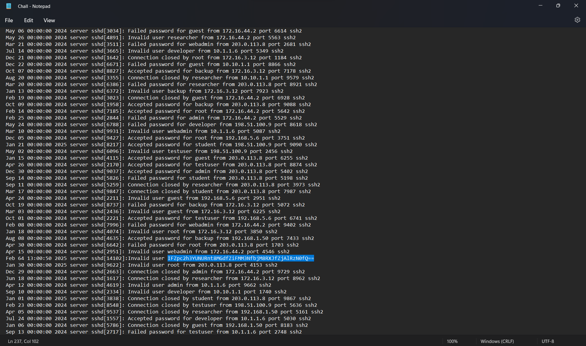
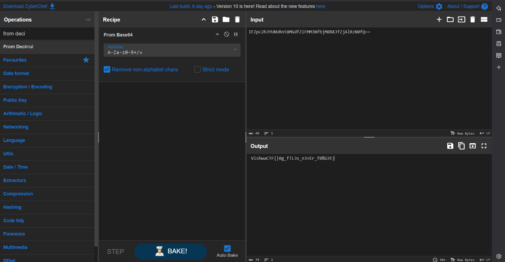

# Dateslip Log 

- This was the easiest challenge but needed to carefully observe 

- There were also some fake base64 in this log file 

- Applied base64 and got the flag 

VishwaCTF{|0g_f!L3s_n3<Er_f0%G3t}