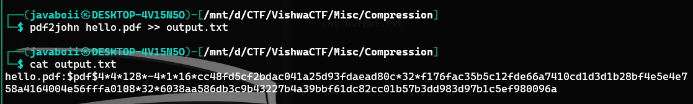
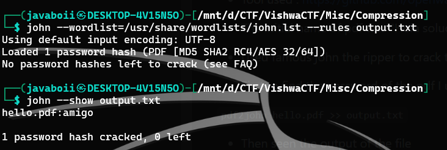
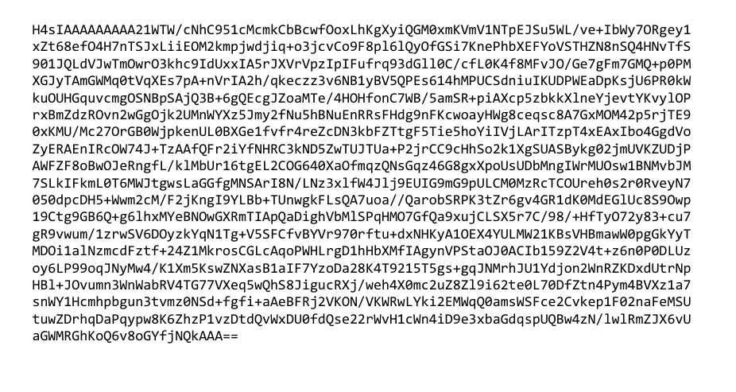
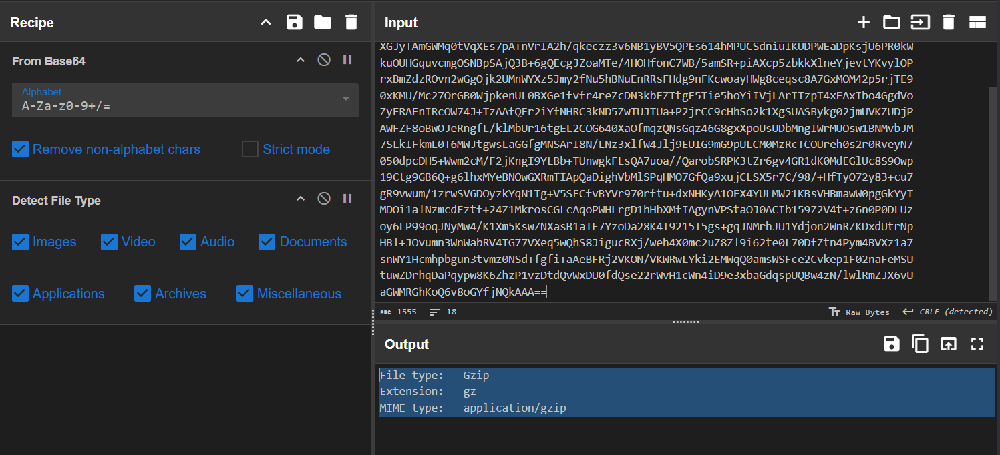
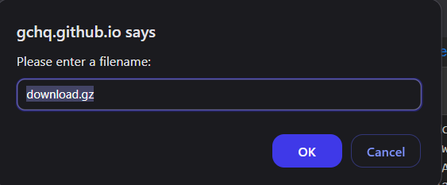
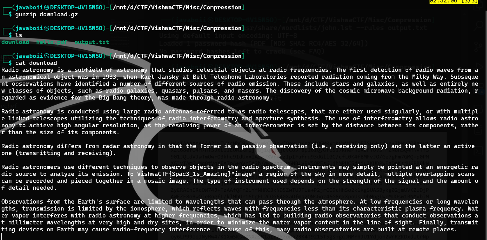

# Compression 

- Tool used : https://github.com/openwall/john

- The initial name of pdf was "Hola solucionador.pdf" but I changed it to "hello.pdf" 

- Used famous john the ripper to crack the password 

- First to find the password of the pdf I used "pdf2john" 

``` pdf2john hello.pdf >> output.txt ```

- Then seen the output of the file 

``` cat output.txt ``` 



- The very next step was followed to get password from the output from "pdf2john"

``` john --wordlist=/usr/share/wordlists/john.lst --rules output.txt ```

- The john.lst here is literally rockyou.txt 😅

``` john --show output.txt ``` 



- Got this huge text in the pdf file 



- In cyberchef it is detected as the zip 



- Downloaded from the save button in the cyberchef



- Unzipping the file and then reading it got the flag 



VishwaCTF{Spac3_1s_Amaz1ng}