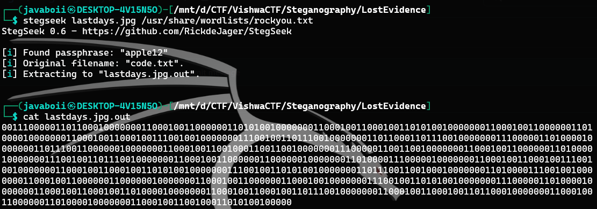
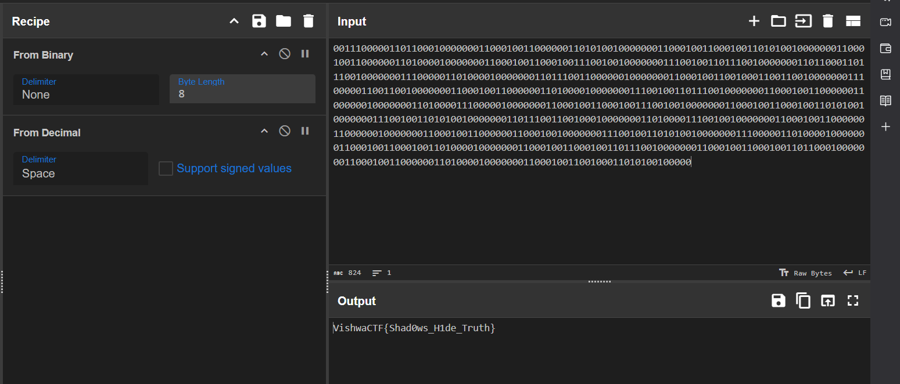

# Lost Evidence

- Tool used : https://github.com/RickdeJager/stegseek

Tried exiftool if there is hidden information and then used some steganography tools 

``` stegseek lastdays.jpg /usr/share/wordlists/rockyou.txt ```

- Tried with the rockyou.txt that is available 
- Viewed the output file 

```  cat lastdays.jpg.out ```



- Taken the binary to CyberChef website to decode it 
- Used below recipe to configure the flag from the Binary



VishwaCTF{Shad0ws_H1de_Truth}